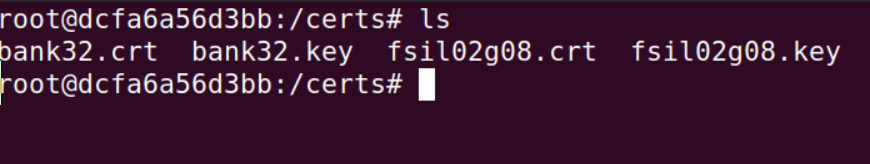
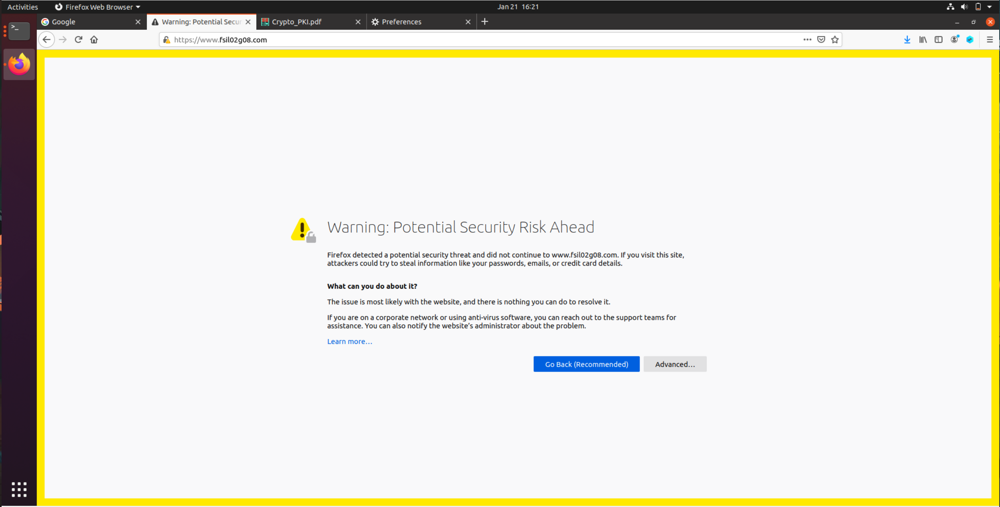
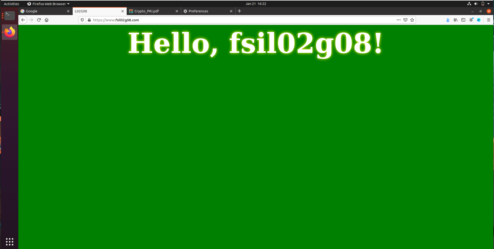
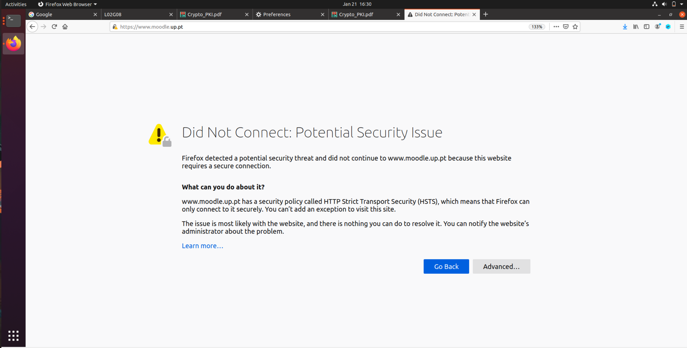
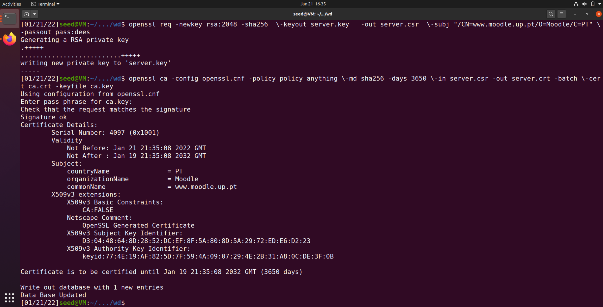
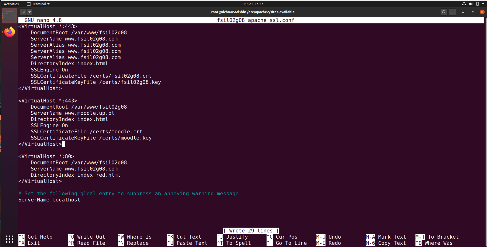
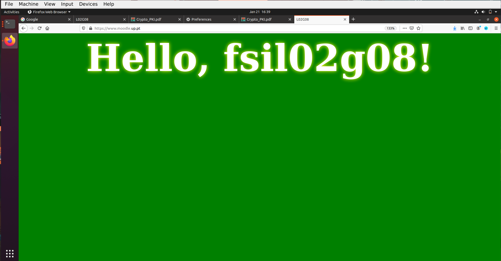

# SeedLabs: Public-Key Infrastructure
## Task 1

Após executar os comandos referidos no enunciado, obtivemos os seguintes outputs:

```bash
[01/21/22]seed@VM:~/.../wd$ openssl x509 -in ca.crt -text -noout
Certificate:
    Data:
        Version: 3 (0x2)
        Serial Number:
            77:b5:2b:ce:da:81:93:c0:9d:3f:0b:aa:9b:ae:70:e3:fa:48:f3:40
        Signature Algorithm: sha256WithRSAEncryption
        Issuer: C = PT, ST = Porto, L = Porto, O = FEUP, OU = LEIC, CN = l02g08, emailAddress = l02g08@something.com
        Validity
            Not Before: Jan 21 20:46:51 2022 GMT
            Not After : Jan 19 20:46:51 2032 GMT
        Subject: C = PT, ST = Porto, L = Porto, O = FEUP, OU = LEIC, CN = l02g08, emailAddress = l02g08@something.com
        Subject Public Key Info:
            Public Key Algorithm: rsaEncryption
                RSA Public-Key: (4096 bit)
                Modulus:
                    00:eb:9e:e2:ba:54:e4:8c:76:2c:9f:f6:0a:e5:2b:
                    bf:9a:91:47:72:e7:20:56:61:89:50:74:54:38:81:
                    2f:fe:fc:e6:e8:88:8f:2e:be:d4:ca:69:a0:32:17:
                    a4:1b:56:e8:9f:9d:7a:ec:f8:cd:0a:39:d7:af:c3:
                    2c:a3:9d:73:8f:0a:5a:b0:96:2a:94:53:f2:bd:18:
                    72:19:63:07:9b:ed:9c:7a:df:54:e6:ed:61:3f:ba:
                    3e:11:d6:88:76:3a:fc:e7:15:06:5e:9c:8f:19:9b:
                    43:0f:bb:43:3f:ac:d1:0e:e5:6d:c6:81:28:0f:a0:
                    d9:59:57:fa:fd:cd:f2:93:a0:3a:50:56:3c:f3:fb:
                    b3:94:f5:32:d5:b4:eb:df:3e:df:c8:e8:f1:09:3d:
                    13:5b:1a:21:3e:85:46:a0:4c:75:fd:a4:4f:5e:6c:
                    16:c8:38:2e:42:15:6d:53:86:1b:05:e9:cd:79:cd:
                    eb:2a:8e:b9:0d:e8:52:39:ae:66:b7:f4:d0:9c:5b:
                    8a:32:72:9d:49:a9:7e:4a:50:79:4f:88:f3:3e:74:
                    82:b1:f3:2a:c1:78:bc:f5:db:1d:a7:5e:0a:c9:37:
                    6b:58:ad:6b:1c:d6:a3:ed:1c:58:33:c1:ef:d0:47:
                    a7:ca:83:b5:4b:97:5e:37:e4:c3:bd:82:a7:00:5c:
                    2f:85:04:76:b3:d4:ff:c1:dd:20:25:26:ea:4e:a6:
                    62:ae:3e:e6:0c:47:3b:68:e8:e8:f3:ae:23:34:3c:
                    3a:72:1a:65:e6:4f:a5:ca:58:88:df:89:69:e8:f3:
                    6f:05:e8:61:64:7a:71:dc:7c:07:12:34:50:0d:8e:
                    a4:4f:3d:cc:f8:a3:fe:6e:3c:5f:56:c0:e3:17:c9:
                    2f:9f:b0:f5:f9:35:33:fc:5f:a8:c5:09:ba:84:40:
                    85:7c:98:3e:b4:f0:aa:cc:c7:29:f8:a8:a0:06:96:
                    c8:13:79:c8:ba:a7:f4:67:bb:62:0d:38:1c:56:a2:
                    83:e2:8c:30:fe:0f:3e:22:8b:50:22:cd:fb:89:7e:
                    88:52:6f:41:36:68:e5:5c:bc:20:18:2e:6d:c5:be:
                    a0:30:49:32:55:fa:2a:7e:44:7c:12:87:6a:7b:0b:
                    f1:e9:04:5b:78:24:04:83:74:9e:3c:e2:8a:58:ff:
                    90:90:f4:4b:8d:9d:dc:c0:25:70:1a:39:4d:6d:59:
                    ab:32:03:d4:39:39:96:bf:ad:2d:e9:ef:0f:ff:8b:
                    dc:16:5f:8a:e7:9a:52:2b:30:e0:8f:7b:16:04:bf:
                    24:50:48:ee:09:9f:f4:5f:68:98:7f:c9:fe:6e:b0:
                    da:d4:2c:4e:62:2c:4c:5b:13:23:66:ae:fa:db:0e:
                    76:c0:99
                Exponent: 65537 (0x10001)
        X509v3 extensions:
            X509v3 Subject Key Identifier: 
                77:4E:19:AF:82:5D:7F:59:4A:09:07:29:4E:2B:31:A8:0C:DE:3F:0B
            X509v3 Authority Key Identifier: 
                keyid:77:4E:19:AF:82:5D:7F:59:4A:09:07:29:4E:2B:31:A8:0C:DE:3F:0B

            X509v3 Basic Constraints: critical
                CA:TRUE
    Signature Algorithm: sha256WithRSAEncryption
         e6:f2:98:d4:7d:4a:92:5f:7c:9c:48:50:09:13:5d:41:b3:19:
         10:4f:05:11:d8:e8:f5:88:fd:8b:22:c6:5f:9d:46:4b:ba:92:
         e3:54:a1:65:29:65:72:07:e8:c7:e2:d4:d3:5f:a0:23:46:38:
         29:97:80:4e:1b:ea:90:c9:7d:ef:ea:81:f3:67:0b:1b:28:63:
         dd:ef:ec:ca:92:ac:57:e4:55:db:3f:63:0c:76:6e:d0:ec:2b:
         f3:7e:31:6b:26:18:02:fa:bc:f5:71:b5:1e:59:37:b7:90:2c:
         6b:f0:5b:11:ee:a5:f8:bc:77:2d:52:b2:bc:f8:51:e0:fc:30:
         0a:18:fe:27:d4:89:9b:0f:b3:d6:3e:f0:85:ee:64:36:36:13:
         d3:88:57:2f:82:3f:20:5f:4e:a0:27:67:c2:51:6a:9a:7a:43:
         0b:0f:85:72:c0:92:1b:f0:cc:36:89:df:59:be:a0:47:28:55:
         8f:a9:c2:40:0b:eb:92:75:cd:99:12:f7:28:9a:9e:38:f9:49:
         37:47:53:58:60:da:14:f7:02:c0:06:9e:0f:47:2f:04:53:5a:
         71:ca:3c:bc:5a:ee:3a:2f:89:8d:a1:dc:3e:b9:23:74:44:2e:
         7b:e1:5e:55:19:5f:94:b6:1e:96:22:2e:ec:71:be:55:cc:ed:
         16:a0:dd:d6:25:4f:bf:12:43:cb:23:a8:5c:b0:ca:25:55:48:
         72:cb:49:14:09:b5:bb:c6:e1:af:a0:1c:f9:e7:d9:49:ec:8c:
         76:8c:1a:01:15:3e:a0:77:e1:95:1d:ab:a4:07:c1:1e:4a:22:
         b9:e4:28:15:96:d6:0e:d9:d8:b2:de:56:ca:df:7d:0c:a1:1f:
         5c:fb:0c:b3:c9:dd:9e:0f:0d:1a:7d:4f:ee:e2:0a:1f:e9:6c:
         a8:5e:ae:59:3c:7b:6a:f0:70:76:8f:07:f8:f1:8c:20:c7:56:
         3e:ee:86:ed:53:96:46:b8:bc:f4:0e:f4:20:0d:75:e1:d8:30:
         7c:b6:75:10:d3:f0:28:e2:a8:ad:3a:ad:08:fa:31:01:25:35:
         06:a9:b2:0c:59:70:54:e7:75:9c:ac:ad:62:1d:b0:dd:cf:53:
         2b:1c:ae:ea:4e:cb:57:de:5b:25:f0:b2:5f:11:83:6b:47:47:
         b7:7c:4f:4e:c5:cd:3b:2c:e5:40:2c:c9:d8:1d:ad:a5:07:b1:
         da:f9:f6:ec:ae:c8:44:fc:b5:b8:e1:b0:41:4d:10:36:6b:91:
         b7:32:1b:82:15:95:61:59:67:ea:ce:0d:8f:5c:b6:9e:6e:12:
         b5:56:71:db:7a:6e:a8:ef:a3:e3:77:4a:96:a5:46:03:76:8c:
         94:8c:4e:51:50:17:c4:fc
```

```
[01/21/22]seed@VM:~/.../wd$ openssl rsa  -in ca.key -text -noout
Enter pass phrase for ca.key:
RSA Private-Key: (4096 bit, 2 primes)
modulus:
    00:eb:9e:e2:ba:54:e4:8c:76:2c:9f:f6:0a:e5:2b:
    bf:9a:91:47:72:e7:20:56:61:89:50:74:54:38:81:
    2f:fe:fc:e6:e8:88:8f:2e:be:d4:ca:69:a0:32:17:
    a4:1b:56:e8:9f:9d:7a:ec:f8:cd:0a:39:d7:af:c3:
    2c:a3:9d:73:8f:0a:5a:b0:96:2a:94:53:f2:bd:18:
    72:19:63:07:9b:ed:9c:7a:df:54:e6:ed:61:3f:ba:
    3e:11:d6:88:76:3a:fc:e7:15:06:5e:9c:8f:19:9b:
    43:0f:bb:43:3f:ac:d1:0e:e5:6d:c6:81:28:0f:a0:
    d9:59:57:fa:fd:cd:f2:93:a0:3a:50:56:3c:f3:fb:
    b3:94:f5:32:d5:b4:eb:df:3e:df:c8:e8:f1:09:3d:
    13:5b:1a:21:3e:85:46:a0:4c:75:fd:a4:4f:5e:6c:
    16:c8:38:2e:42:15:6d:53:86:1b:05:e9:cd:79:cd:
    eb:2a:8e:b9:0d:e8:52:39:ae:66:b7:f4:d0:9c:5b:
    8a:32:72:9d:49:a9:7e:4a:50:79:4f:88:f3:3e:74:
    82:b1:f3:2a:c1:78:bc:f5:db:1d:a7:5e:0a:c9:37:
    6b:58:ad:6b:1c:d6:a3:ed:1c:58:33:c1:ef:d0:47:
    a7:ca:83:b5:4b:97:5e:37:e4:c3:bd:82:a7:00:5c:
    2f:85:04:76:b3:d4:ff:c1:dd:20:25:26:ea:4e:a6:
    62:ae:3e:e6:0c:47:3b:68:e8:e8:f3:ae:23:34:3c:
    3a:72:1a:65:e6:4f:a5:ca:58:88:df:89:69:e8:f3:
    6f:05:e8:61:64:7a:71:dc:7c:07:12:34:50:0d:8e:
    a4:4f:3d:cc:f8:a3:fe:6e:3c:5f:56:c0:e3:17:c9:
    2f:9f:b0:f5:f9:35:33:fc:5f:a8:c5:09:ba:84:40:
    85:7c:98:3e:b4:f0:aa:cc:c7:29:f8:a8:a0:06:96:
    c8:13:79:c8:ba:a7:f4:67:bb:62:0d:38:1c:56:a2:
    83:e2:8c:30:fe:0f:3e:22:8b:50:22:cd:fb:89:7e:
    88:52:6f:41:36:68:e5:5c:bc:20:18:2e:6d:c5:be:
    a0:30:49:32:55:fa:2a:7e:44:7c:12:87:6a:7b:0b:
    f1:e9:04:5b:78:24:04:83:74:9e:3c:e2:8a:58:ff:
    90:90:f4:4b:8d:9d:dc:c0:25:70:1a:39:4d:6d:59:
    ab:32:03:d4:39:39:96:bf:ad:2d:e9:ef:0f:ff:8b:
    dc:16:5f:8a:e7:9a:52:2b:30:e0:8f:7b:16:04:bf:
    24:50:48:ee:09:9f:f4:5f:68:98:7f:c9:fe:6e:b0:
    da:d4:2c:4e:62:2c:4c:5b:13:23:66:ae:fa:db:0e:
    76:c0:99
publicExponent: 65537 (0x10001)
privateExponent:
    4e:c2:be:c1:50:6d:51:72:93:3a:29:51:bd:07:61:
    b5:f6:48:2e:e5:89:8e:b6:6d:e3:21:ef:a1:2f:b5:
    ee:83:75:60:57:7d:9d:3f:96:fb:ce:51:09:4d:93:
    c2:bb:cb:68:c7:88:76:bc:38:35:e9:dd:ea:57:d0:
    8d:24:ad:a3:2b:ef:e2:c5:5f:98:53:73:79:b8:39:
    33:b9:41:aa:e2:c3:82:e3:32:8b:3a:e0:5e:20:10:
    6d:80:0b:ff:91:7a:46:78:65:b7:ac:97:bd:14:84:
    57:36:de:a4:e3:4c:c2:b0:f8:7f:f9:5e:7d:d2:e3:
    b4:94:cf:46:95:d8:37:76:c0:e7:67:dc:5a:26:52:
    02:41:f0:6b:35:5d:ff:33:12:35:23:80:a6:f8:ee:
    86:6e:76:9c:62:8a:98:3c:d6:d8:21:5b:92:91:89:
    10:06:8f:97:f1:77:a9:0a:d3:ef:a7:16:d3:57:7c:
    fb:ad:d7:b8:09:67:aa:f6:5c:49:b3:a1:24:13:09:
    60:11:a5:f8:20:9b:21:96:42:e6:ce:3d:99:2b:f3:
    20:2e:cb:a4:fe:8a:13:98:da:11:bf:42:d5:be:1b:
    b8:f9:c7:2b:4d:a8:60:33:30:5c:a4:c0:58:1c:0b:
    bf:8b:45:47:ee:62:45:46:c8:13:8a:1f:ee:e3:e1:
    d1:ed:c7:9b:5a:8a:b9:8b:a0:67:1e:4f:4e:9d:65:
    98:1b:b2:f3:4d:6a:f8:17:a7:8e:4c:94:cf:cb:27:
    34:64:2f:49:bc:6f:90:9a:57:eb:33:75:5f:3d:93:
    31:cc:61:73:99:76:ce:cf:c1:2f:2d:10:2d:17:fb:
    7b:3f:9c:c5:01:e6:d6:0e:27:86:e8:2b:eb:ce:02:
    89:d1:d6:2a:9b:65:d9:22:cf:a1:77:91:26:61:90:
    78:e0:91:25:94:a7:fc:93:a0:fc:97:55:ca:9a:e9:
    3c:a6:46:83:42:8e:87:49:04:a4:1a:64:3d:0f:08:
    ae:d3:96:21:fe:e6:67:80:10:e0:c7:7d:d8:0e:71:
    f1:b3:7e:a8:17:20:fe:ba:07:65:68:7c:d3:2c:e1:
    cb:3c:13:14:cf:e1:6b:4c:8e:23:dc:1d:76:7c:45:
    f2:34:d4:aa:2c:49:d0:f1:29:db:ca:a8:19:6f:25:
    b9:20:db:b6:b7:dd:3d:24:58:1b:0f:35:10:41:42:
    60:a9:90:e9:bf:7d:dc:b7:2c:ca:d4:85:39:fc:2c:
    8c:15:33:f1:00:ca:86:f1:7e:00:1f:25:f4:7e:de:
    42:fb:4e:7f:68:23:ce:f2:b3:92:9e:06:d4:13:eb:
    f4:56:14:ff:a1:35:cd:db:a8:94:30:a1:b4:8b:6c:
    ae:81
prime1:
    00:fc:cc:9e:01:2b:6e:60:62:23:7c:c0:e6:e1:da:
    c9:b6:42:f2:67:0f:98:36:b1:c3:e2:1a:04:0a:e9:
    f2:34:54:0e:9a:b0:4f:07:f9:c7:5e:c8:04:b3:79:
    4a:21:af:7a:c9:17:a3:e5:34:1a:d8:9a:72:27:e6:
    3b:43:b7:30:2c:b1:17:f6:f7:96:15:cc:42:66:f4:
    79:02:81:1a:62:26:ec:a6:fe:24:fa:16:ec:4c:a9:
    50:a8:6b:d7:f5:86:bf:56:c5:e4:bf:d8:11:2a:a5:
    1a:88:59:2c:25:c0:b9:0d:be:86:09:b0:60:85:e5:
    5f:f4:de:ea:87:b6:09:32:6d:b0:df:6f:aa:1f:16:
    92:b6:4f:cb:19:15:d1:5e:e1:37:e9:3e:59:3a:d5:
    dd:c6:9f:98:10:d3:17:c3:ed:f3:f3:2c:c1:71:a9:
    bb:81:64:8a:c3:2e:d4:95:c6:dd:ce:eb:a8:98:a3:
    50:e0:35:32:bf:cb:4e:68:19:8c:72:87:90:52:1d:
    ae:35:ce:5e:9e:68:8b:89:c5:82:0d:e7:7c:76:24:
    75:06:2f:65:a7:71:8f:4a:47:0c:e0:80:04:9e:75:
    87:d9:8d:34:60:dc:12:74:ad:e4:05:4e:41:16:6e:
    3a:0a:df:dc:ab:1d:60:da:85:ec:c8:7d:d0:cd:8e:
    e4:b1
prime2:
    00:ee:9a:96:a0:4e:53:0f:fe:bf:a4:bc:0d:04:ff:
    ad:74:8f:6f:15:7d:78:28:53:e3:31:fb:2f:30:25:
    59:72:b0:2f:84:54:b8:5f:b5:94:b8:7d:a8:56:6a:
    33:7d:75:16:b5:13:4f:01:ef:92:e4:91:a5:ea:ab:
    04:0f:4e:64:b2:63:1b:aa:c8:be:64:a3:42:f9:3d:
    fe:23:a1:3c:6e:b6:34:e2:d4:da:b5:a9:c3:a6:23:
    c6:dd:be:da:ff:2a:71:1f:81:d6:be:04:b6:b2:5b:
    b3:44:40:39:1b:b5:62:6c:1b:1b:67:35:e5:d4:91:
    5a:84:78:d1:c8:f1:a0:e2:86:d7:97:f8:91:2e:15:
    6b:01:d8:a9:72:8d:2e:c1:19:59:14:3b:1a:16:3c:
    95:96:7e:65:f4:04:fd:84:7f:f3:92:8d:f9:ce:ad:
    05:32:c4:44:f9:ac:44:1c:0d:bb:ec:f9:f1:2f:5e:
    ed:1a:4e:55:af:14:87:7d:de:ad:32:20:e9:d8:52:
    bf:82:0c:08:33:04:a5:8c:57:0d:67:9a:2f:6b:f9:
    b2:d5:78:be:34:22:db:d2:59:50:27:98:de:1f:c9:
    28:d3:04:63:e9:15:cf:7d:0d:f1:47:18:99:d3:f6:
    ec:65:df:0f:0b:29:f6:a3:d0:b2:57:11:ff:14:97:
    34:69
exponent1:
    79:fe:1c:39:a0:45:d1:89:4a:6a:c7:84:23:75:bb:
    65:93:04:fb:2b:11:5f:43:85:ad:b4:b4:42:b8:06:
    c3:ad:d4:a6:5d:72:a5:fc:a9:73:59:be:bb:05:4a:
    fa:da:7d:bc:51:06:2c:73:6a:89:20:6e:fa:46:26:
    4f:55:35:90:3b:9d:be:f6:57:9d:09:46:f9:fb:fb:
    f1:73:6f:d1:f1:ca:be:03:62:c0:b5:13:2f:23:7d:
    e2:e8:b7:fc:aa:1b:e7:b9:f3:db:88:5f:30:5f:20:
    60:af:f7:97:f8:5a:d5:01:1e:19:ca:dd:a9:7f:b9:
    40:a7:da:31:c7:6c:c4:c3:1e:59:94:bf:59:e5:40:
    c3:6d:da:2a:ae:d6:ac:9c:ae:a8:86:07:f5:56:83:
    81:78:3e:9f:cf:de:66:14:8c:66:cb:30:46:b3:8b:
    e2:b3:2c:2b:68:8b:fa:03:4f:c2:ad:02:5d:36:62:
    ae:ef:bd:1f:c4:f2:7f:55:e4:ea:d7:f4:93:4b:f3:
    67:cf:c0:e5:5c:ba:09:b0:20:44:a9:72:ec:68:47:
    78:c6:a2:9d:9d:35:72:b8:ba:c4:13:c3:26:dc:bc:
    c4:05:5a:43:6b:b0:14:52:5d:f9:19:7c:5b:60:b1:
    ed:d1:7d:e1:ad:79:b1:ba:73:3b:85:4b:a0:06:d6:
    e1
exponent2:
    2b:b7:d7:71:77:e8:70:3d:d5:0f:72:05:50:ad:28:
    32:fb:34:f7:53:0d:f9:15:a5:c3:3a:aa:e2:bf:75:
    2c:36:6b:fe:6b:27:7d:21:e0:26:0d:a0:12:75:53:
    09:e1:b2:4f:6b:42:46:b0:86:d1:aa:7e:24:09:41:
    ad:2c:47:f7:07:81:c2:41:15:e1:8a:a8:72:d2:91:
    06:26:3c:d4:6c:3e:34:71:9b:c1:3d:61:c3:c7:3a:
    60:d6:df:79:71:65:58:c8:89:78:37:94:e2:09:3b:
    47:7e:1c:f8:9e:bb:71:e3:65:99:fb:9e:28:dc:99:
    21:3c:a1:f3:97:92:4a:ef:3a:01:76:61:e3:77:b9:
    2b:95:6f:36:b5:f7:a3:19:e9:e0:73:13:cc:8f:3d:
    39:5d:df:80:5e:89:b5:05:5c:b3:b5:9f:d7:e6:8b:
    d5:49:70:f9:ee:3e:6c:85:77:b1:6b:fa:6d:1b:8f:
    86:0a:64:58:b8:02:3b:65:d9:86:1d:d1:ba:f9:2e:
    6d:bd:96:a3:02:6e:f2:cf:e0:7c:e3:1b:5d:45:5b:
    27:12:00:87:bc:fb:5a:07:53:50:6e:0a:04:f8:ee:
    a9:fb:5b:f3:11:33:fb:4d:da:af:94:2a:5b:54:1a:
    ec:6f:7a:6a:29:3e:2f:b5:c5:77:7e:ac:a6:31:2e:
    41
coefficient:
    15:41:09:81:c2:83:00:16:df:d2:cd:de:42:e4:db:
    f5:a4:9a:e7:77:ed:62:82:a8:8e:9d:eb:af:dd:f7:
    0e:bd:c3:d9:91:e4:a0:f2:35:f1:06:c2:98:b3:3d:
    8e:94:3d:7a:45:bf:0a:58:52:eb:7f:75:4e:24:91:
    66:6d:1a:e6:82:9d:b2:19:2d:df:8c:c0:c3:9a:0e:
    e2:e9:8e:8e:05:7c:c2:92:fd:a4:89:dd:13:0e:b8:
    59:2f:7b:88:71:de:5a:1b:ab:6b:2f:5e:a4:79:de:
    2d:19:e8:b9:db:19:25:c3:66:54:0c:a6:7f:5d:33:
    51:6a:32:22:25:6b:9c:4f:01:a5:52:08:d6:41:48:
    43:60:10:50:5a:55:0e:0b:4c:00:70:c4:e3:bf:ca:
    ca:7f:1a:44:26:51:bd:6d:94:b9:9b:a3:c6:84:5f:
    98:92:b0:26:aa:6c:99:33:2d:86:36:c4:ee:bb:e6:
    c3:6f:bd:6b:e4:1b:9f:ea:3d:c8:95:76:07:fd:c1:
    f6:49:51:0e:ac:92:df:a3:3a:40:e8:82:db:5a:65:
    01:e6:5b:a2:91:1f:5d:bd:cb:f2:74:df:a0:ca:a3:
    d7:58:bc:46:22:41:dc:30:f1:a4:0b:0e:41:35:84:
    75:ce:d4:37:26:ca:24:78:aa:da:72:4a:e4:cf:f7:
    6e
```

Assim, respondendo às questões neste referidas:

Que parte do certificado indica que este é um certificado CA?

- O primeiro ficheiro possui a informação `CA:TRUE`.

Que parte do certificado indica que é um certificado auto-assinado?

- Como podemos ver no excerto do ficheiro abaixo, o `Issuer` e o `Subject` são iguais, mostrando que o certificado foi assinado por si próprio.

```
Issuer: C = PT, ST = Porto, L = Porto, O = FEUP, OU = LEIC, CN = l02g08, emailAddress = l02g08@something.com
...
Subject: C = PT, ST = Porto, L = Porto, O = FEUP, OU = LEIC, CN = l02g08, emailAddress = l02g08@something.com
```

No algoritmo RSA temos um expoente público e, um expoente privado d, um módulo n, e dois números secretos p e q tal que n = pq. Por favor identifique os valores destes elementos nos seus certificados e ficheiros chave.

- Expoente público, e: `publicExponent: 65537 (0x10001)`
- Expoente privado, d:

    ```
    privateExponent:
    4e:c2:be:c1:50:6d:51:72:93:3a:29:51:bd:07:61:
    b5:f6:48:2e:e5:89:8e:b6:6d:e3:21:ef:a1:2f:b5:
    ee:83:75:60:57:7d:9d:3f:96:fb:ce:51:09:4d:93:
    c2:bb:cb:68:c7:88:76:bc:38:35:e9:dd:ea:57:d0:
    8d:24:ad:a3:2b:ef:e2:c5:5f:98:53:73:79:b8:39:
    33:b9:41:aa:e2:c3:82:e3:32:8b:3a:e0:5e:20:10:
    6d:80:0b:ff:91:7a:46:78:65:b7:ac:97:bd:14:84:
    57:36:de:a4:e3:4c:c2:b0:f8:7f:f9:5e:7d:d2:e3:
    b4:94:cf:46:95:d8:37:76:c0:e7:67:dc:5a:26:52:
    02:41:f0:6b:35:5d:ff:33:12:35:23:80:a6:f8:ee:
    86:6e:76:9c:62:8a:98:3c:d6:d8:21:5b:92:91:89:
    10:06:8f:97:f1:77:a9:0a:d3:ef:a7:16:d3:57:7c:
    fb:ad:d7:b8:09:67:aa:f6:5c:49:b3:a1:24:13:09:
    60:11:a5:f8:20:9b:21:96:42:e6:ce:3d:99:2b:f3:
    20:2e:cb:a4:fe:8a:13:98:da:11:bf:42:d5:be:1b:
    b8:f9:c7:2b:4d:a8:60:33:30:5c:a4:c0:58:1c:0b:
    bf:8b:45:47:ee:62:45:46:c8:13:8a:1f:ee:e3:e1:
    d1:ed:c7:9b:5a:8a:b9:8b:a0:67:1e:4f:4e:9d:65:
    98:1b:b2:f3:4d:6a:f8:17:a7:8e:4c:94:cf:cb:27:
    34:64:2f:49:bc:6f:90:9a:57:eb:33:75:5f:3d:93:
    31:cc:61:73:99:76:ce:cf:c1:2f:2d:10:2d:17:fb:
    7b:3f:9c:c5:01:e6:d6:0e:27:86:e8:2b:eb:ce:02:
    89:d1:d6:2a:9b:65:d9:22:cf:a1:77:91:26:61:90:
    78:e0:91:25:94:a7:fc:93:a0:fc:97:55:ca:9a:e9:
    3c:a6:46:83:42:8e:87:49:04:a4:1a:64:3d:0f:08:
    ae:d3:96:21:fe:e6:67:80:10:e0:c7:7d:d8:0e:71:
    f1:b3:7e:a8:17:20:fe:ba:07:65:68:7c:d3:2c:e1:
    cb:3c:13:14:cf:e1:6b:4c:8e:23:dc:1d:76:7c:45:
    f2:34:d4:aa:2c:49:d0:f1:29:db:ca:a8:19:6f:25:
    b9:20:db:b6:b7:dd:3d:24:58:1b:0f:35:10:41:42:
    60:a9:90:e9:bf:7d:dc:b7:2c:ca:d4:85:39:fc:2c:
    8c:15:33:f1:00:ca:86:f1:7e:00:1f:25:f4:7e:de:
    42:fb:4e:7f:68:23:ce:f2:b3:92:9e:06:d4:13:eb:
    f4:56:14:ff:a1:35:cd:db:a8:94:30:a1:b4:8b:6c:
    ae:81
    ```

    - Módulo, d:

    ```
    modulus:
    00:eb:9e:e2:ba:54:e4:8c:76:2c:9f:f6:0a:e5:2b:
    bf:9a:91:47:72:e7:20:56:61:89:50:74:54:38:81:
    2f:fe:fc:e6:e8:88:8f:2e:be:d4:ca:69:a0:32:17:
    a4:1b:56:e8:9f:9d:7a:ec:f8:cd:0a:39:d7:af:c3:
    2c:a3:9d:73:8f:0a:5a:b0:96:2a:94:53:f2:bd:18:
    72:19:63:07:9b:ed:9c:7a:df:54:e6:ed:61:3f:ba:
    3e:11:d6:88:76:3a:fc:e7:15:06:5e:9c:8f:19:9b:
    43:0f:bb:43:3f:ac:d1:0e:e5:6d:c6:81:28:0f:a0:
    d9:59:57:fa:fd:cd:f2:93:a0:3a:50:56:3c:f3:fb:
    b3:94:f5:32:d5:b4:eb:df:3e:df:c8:e8:f1:09:3d:
    13:5b:1a:21:3e:85:46:a0:4c:75:fd:a4:4f:5e:6c:
    16:c8:38:2e:42:15:6d:53:86:1b:05:e9:cd:79:cd:
    eb:2a:8e:b9:0d:e8:52:39:ae:66:b7:f4:d0:9c:5b:
    8a:32:72:9d:49:a9:7e:4a:50:79:4f:88:f3:3e:74:
    82:b1:f3:2a:c1:78:bc:f5:db:1d:a7:5e:0a:c9:37:
    6b:58:ad:6b:1c:d6:a3:ed:1c:58:33:c1:ef:d0:47:
    a7:ca:83:b5:4b:97:5e:37:e4:c3:bd:82:a7:00:5c:
    2f:85:04:76:b3:d4:ff:c1:dd:20:25:26:ea:4e:a6:
    62:ae:3e:e6:0c:47:3b:68:e8:e8:f3:ae:23:34:3c:
    3a:72:1a:65:e6:4f:a5:ca:58:88:df:89:69:e8:f3:
    6f:05:e8:61:64:7a:71:dc:7c:07:12:34:50:0d:8e:
    a4:4f:3d:cc:f8:a3:fe:6e:3c:5f:56:c0:e3:17:c9:
    2f:9f:b0:f5:f9:35:33:fc:5f:a8:c5:09:ba:84:40:
    85:7c:98:3e:b4:f0:aa:cc:c7:29:f8:a8:a0:06:96:
    c8:13:79:c8:ba:a7:f4:67:bb:62:0d:38:1c:56:a2:
    83:e2:8c:30:fe:0f:3e:22:8b:50:22:cd:fb:89:7e:
    88:52:6f:41:36:68:e5:5c:bc:20:18:2e:6d:c5:be:
    a0:30:49:32:55:fa:2a:7e:44:7c:12:87:6a:7b:0b:
    f1:e9:04:5b:78:24:04:83:74:9e:3c:e2:8a:58:ff:
    90:90:f4:4b:8d:9d:dc:c0:25:70:1a:39:4d:6d:59:
    ab:32:03:d4:39:39:96:bf:ad:2d:e9:ef:0f:ff:8b:
    dc:16:5f:8a:e7:9a:52:2b:30:e0:8f:7b:16:04:bf:
    24:50:48:ee:09:9f:f4:5f:68:98:7f:c9:fe:6e:b0:
    da:d4:2c:4e:62:2c:4c:5b:13:23:66:ae:fa:db:0e:
    76:c0:99
    ```

    - p:

    ```
    prime1:
    00:fc:cc:9e:01:2b:6e:60:62:23:7c:c0:e6:e1:da:
    c9:b6:42:f2:67:0f:98:36:b1:c3:e2:1a:04:0a:e9:
    f2:34:54:0e:9a:b0:4f:07:f9:c7:5e:c8:04:b3:79:
    4a:21:af:7a:c9:17:a3:e5:34:1a:d8:9a:72:27:e6:
    3b:43:b7:30:2c:b1:17:f6:f7:96:15:cc:42:66:f4:
    79:02:81:1a:62:26:ec:a6:fe:24:fa:16:ec:4c:a9:
    50:a8:6b:d7:f5:86:bf:56:c5:e4:bf:d8:11:2a:a5:
    1a:88:59:2c:25:c0:b9:0d:be:86:09:b0:60:85:e5:
    5f:f4:de:ea:87:b6:09:32:6d:b0:df:6f:aa:1f:16:
    92:b6:4f:cb:19:15:d1:5e:e1:37:e9:3e:59:3a:d5:
    dd:c6:9f:98:10:d3:17:c3:ed:f3:f3:2c:c1:71:a9:
    bb:81:64:8a:c3:2e:d4:95:c6:dd:ce:eb:a8:98:a3:
    50:e0:35:32:bf:cb:4e:68:19:8c:72:87:90:52:1d:
    ae:35:ce:5e:9e:68:8b:89:c5:82:0d:e7:7c:76:24:
    75:06:2f:65:a7:71:8f:4a:47:0c:e0:80:04:9e:75:
    87:d9:8d:34:60:dc:12:74:ad:e4:05:4e:41:16:6e:
    3a:0a:df:dc:ab:1d:60:da:85:ec:c8:7d:d0:cd:8e:
    e4:b1
    ```

    - q:

    ```
    prime2:
    00:ee:9a:96:a0:4e:53:0f:fe:bf:a4:bc:0d:04:ff:
    ad:74:8f:6f:15:7d:78:28:53:e3:31:fb:2f:30:25:
    59:72:b0:2f:84:54:b8:5f:b5:94:b8:7d:a8:56:6a:
    33:7d:75:16:b5:13:4f:01:ef:92:e4:91:a5:ea:ab:
    04:0f:4e:64:b2:63:1b:aa:c8:be:64:a3:42:f9:3d:
    fe:23:a1:3c:6e:b6:34:e2:d4:da:b5:a9:c3:a6:23:
    c6:dd:be:da:ff:2a:71:1f:81:d6:be:04:b6:b2:5b:
    b3:44:40:39:1b:b5:62:6c:1b:1b:67:35:e5:d4:91:
    5a:84:78:d1:c8:f1:a0:e2:86:d7:97:f8:91:2e:15:
    6b:01:d8:a9:72:8d:2e:c1:19:59:14:3b:1a:16:3c:
    95:96:7e:65:f4:04:fd:84:7f:f3:92:8d:f9:ce:ad:
    05:32:c4:44:f9:ac:44:1c:0d:bb:ec:f9:f1:2f:5e:
    ed:1a:4e:55:af:14:87:7d:de:ad:32:20:e9:d8:52:
    bf:82:0c:08:33:04:a5:8c:57:0d:67:9a:2f:6b:f9:
    b2:d5:78:be:34:22:db:d2:59:50:27:98:de:1f:c9:
    28:d3:04:63:e9:15:cf:7d:0d:f1:47:18:99:d3:f6:
    ec:65:df:0f:0b:29:f6:a3:d0:b2:57:11:ff:14:97:
    34:69
    ```


## Task 2

```
openssl req -newkey rsa:2048 -sha256  \-keyout server.key   -out server.csr  \-subj "/CN=www.fsil02g08.com/O=L02G08./C=PT" \-passout pass:dees -addext "subjectAltName = DNS:www.fsil02g08.com,  \DNS:www.fsil02g08A.com, \DNS:www.fsil02g08B.com"
```

Utilizando o comando acima apresentado, geramos um certificate request para o nosso servidor:
    
```
[01/21/22]seed@VM:~/.../wd$ openssl req -in server.csr -text -noout
Certificate Request:
    Data:
        Version: 1 (0x0)
        Subject: CN = www.fsil02g08.com, O = L02G08., C = PT
        Subject Public Key Info:
            Public Key Algorithm: rsaEncryption
                RSA Public-Key: (2048 bit)
                Modulus:
                    00:b8:97:83:6b:e9:9d:4d:85:39:e8:ba:f4:4f:2a:
                    3e:b7:26:b0:87:68:71:c1:64:09:79:17:38:c8:fe:
                    97:5d:f4:c1:27:4d:6c:dc:c3:63:09:7a:16:97:f4:
                    1a:1d:f2:5e:ae:2c:3f:71:ca:9c:10:63:12:06:d5:
                    ca:f9:06:79:e8:6f:08:87:be:72:c9:5a:cc:92:a7:
                    7c:7f:ea:c2:a5:6e:65:69:19:a0:2b:f6:8e:3e:75:
                    5f:ed:d6:ea:68:61:19:18:64:c4:9e:f5:84:8c:66:
                    06:7c:e9:54:6c:06:cb:19:82:91:5d:ce:12:b0:68:
                    da:f6:dd:ed:43:83:ed:f4:8b:74:ff:b3:3b:b6:d4:
                    67:54:c7:45:c0:27:0b:66:25:85:13:95:f8:2c:fb:
                    9d:25:a4:fb:c1:9d:f8:bf:0c:ed:dd:93:f0:23:e0:
                    17:f7:25:08:61:15:21:75:80:2b:59:55:84:56:8b:
                    82:d7:14:74:ae:37:4f:12:90:79:09:d5:b8:75:9d:
                    05:0f:e8:e7:6a:33:ba:c4:e6:25:05:a8:6f:eb:4f:
                    a3:9a:34:e3:9a:b8:b0:df:a0:1a:12:5b:73:79:6c:
                    31:bc:b7:aa:bf:e6:74:d2:a4:13:c9:65:3b:d3:e7:
                    e0:1a:d5:fb:23:15:5e:b0:70:44:a4:17:bc:c7:29:
                    d8:c3
                Exponent: 65537 (0x10001)
        Attributes:
            a0:00
    Signature Algorithm: sha256WithRSAEncryption
         07:45:5a:27:f7:1f:ab:c6:bf:40:39:20:d3:2c:b0:49:4f:69:
         ce:be:16:f5:5b:b1:e2:87:2c:c9:9c:ee:c4:17:ad:9f:5f:b4:
         3b:60:43:44:e8:f1:9b:9a:bd:84:c3:38:a8:0b:b3:1f:8f:6d:
         4b:e4:6f:77:e8:9f:ab:df:7d:b0:cc:1e:8c:dc:8b:1d:6e:af:
         6d:7a:02:3b:5a:02:ae:9a:bd:d6:3f:74:c9:bc:58:81:19:b1:
         c4:53:e5:66:dc:b3:d7:17:bf:41:a7:8b:6b:f7:26:7a:e8:eb:
         35:3e:a0:40:55:79:2d:a5:56:a3:61:7a:60:ed:4a:fa:41:be:
         0d:68:20:cb:2a:c1:53:7c:d5:05:ca:24:64:1c:60:01:0c:d6:
         76:c6:46:e6:bd:31:1e:c0:f8:1b:9c:2f:da:7b:96:5d:8a:02:
         df:10:c1:35:2f:20:2b:d4:da:2f:ba:3d:bb:2b:e3:a4:d8:f1:
         1b:03:42:88:be:68:06:1f:7e:e7:35:1c:b8:7a:fa:8c:e6:d9:
         c8:97:96:cb:bc:04:5a:e9:fd:98:3f:c0:70:3b:fd:08:db:05:
         1e:09:7b:3a:2a:9d:53:4d:42:b6:ea:02:e7:55:c9:75:84:2e:
         82:99:27:f6:8e:b4:0f:62:a4:77:2d:51:d6:29:99:5c:dc:c1:
         17:ba:c0:c6
```

```
[01/21/22]seed@VM:~/.../wd$ openssl rsa -in server.key -text -noout
Enter pass phrase for server.key:
RSA Private-Key: (2048 bit, 2 primes)
modulus:
    00:b8:97:83:6b:e9:9d:4d:85:39:e8:ba:f4:4f:2a:
    3e:b7:26:b0:87:68:71:c1:64:09:79:17:38:c8:fe:
    97:5d:f4:c1:27:4d:6c:dc:c3:63:09:7a:16:97:f4:
    1a:1d:f2:5e:ae:2c:3f:71:ca:9c:10:63:12:06:d5:
    ca:f9:06:79:e8:6f:08:87:be:72:c9:5a:cc:92:a7:
    7c:7f:ea:c2:a5:6e:65:69:19:a0:2b:f6:8e:3e:75:
    5f:ed:d6:ea:68:61:19:18:64:c4:9e:f5:84:8c:66:
    06:7c:e9:54:6c:06:cb:19:82:91:5d:ce:12:b0:68:
    da:f6:dd:ed:43:83:ed:f4:8b:74:ff:b3:3b:b6:d4:
    67:54:c7:45:c0:27:0b:66:25:85:13:95:f8:2c:fb:
    9d:25:a4:fb:c1:9d:f8:bf:0c:ed:dd:93:f0:23:e0:
    17:f7:25:08:61:15:21:75:80:2b:59:55:84:56:8b:
    82:d7:14:74:ae:37:4f:12:90:79:09:d5:b8:75:9d:
    05:0f:e8:e7:6a:33:ba:c4:e6:25:05:a8:6f:eb:4f:
    a3:9a:34:e3:9a:b8:b0:df:a0:1a:12:5b:73:79:6c:
    31:bc:b7:aa:bf:e6:74:d2:a4:13:c9:65:3b:d3:e7:
    e0:1a:d5:fb:23:15:5e:b0:70:44:a4:17:bc:c7:29:
    d8:c3
publicExponent: 65537 (0x10001)
privateExponent:
    00:b8:41:b5:53:a0:8b:fe:77:80:08:89:a5:98:e8:
    28:56:15:ee:9c:1b:6b:81:89:63:d3:55:94:bf:3d:
    32:c6:fc:ab:59:99:f5:92:a0:0e:59:c5:5e:8c:2b:
    83:6e:65:22:91:65:65:a7:26:81:85:f1:fe:6a:88:
    39:e5:3d:cb:ae:72:36:e7:98:f9:67:78:95:3f:c6:
    a3:85:e4:46:8b:6f:99:16:c2:17:9a:0a:b0:8e:34:
    07:9f:97:a9:c0:ab:3b:ab:97:da:94:79:aa:e7:a2:
    67:d3:83:ed:5b:2f:a4:c8:40:06:ee:c5:e6:ed:e4:
    9c:bd:53:65:a4:c1:2a:63:b0:a6:9f:99:25:e8:b8:
    8e:4d:9f:ed:c0:21:92:2f:00:eb:75:d5:a3:1a:a7:
    7d:a1:bf:cd:1f:d5:ad:87:5a:89:02:d0:6a:23:09:
    69:f6:eb:e6:27:b6:a0:34:c4:cc:88:69:96:22:90:
    05:97:26:5b:71:72:84:8b:07:35:4b:99:86:0f:91:
    c4:d9:9b:13:68:ee:f3:99:4a:48:e4:31:79:97:31:
    f0:71:01:64:c6:18:80:a4:5d:ef:06:db:e0:47:2b:
    0e:fd:96:78:12:71:cd:7a:ed:57:bb:6b:63:a4:48:
    6c:24:e8:2e:da:49:6e:e5:bb:53:95:bb:47:7b:f5:
    9a:c1
prime1:
    00:e3:2a:85:90:68:22:6d:a8:a6:a0:9b:fe:8c:39:
    b1:ab:b7:89:b9:74:00:32:d1:ba:2f:3f:ff:fc:76:
    95:8f:de:73:a0:0a:e0:81:77:2e:d8:f2:22:8c:52:
    8a:7c:60:ef:58:e4:47:9f:ba:a8:06:8d:12:36:42:
    7b:c7:15:db:df:10:cb:84:ec:5c:26:ee:93:68:85:
    2a:b9:07:44:5e:b2:d3:8d:20:c7:fe:1c:bf:ef:bb:
    4b:cb:ac:bb:21:26:a9:5f:ef:03:66:20:ff:6c:98:
    e2:4b:8d:0f:9a:fc:09:04:94:41:2b:9f:0e:81:a2:
    67:05:35:fb:6d:53:f1:fe:71
prime2:
    00:d0:05:98:36:e9:2c:b7:39:51:7e:48:2f:c8:37:
    8b:db:f6:7e:56:5f:97:9e:0a:83:88:08:6b:51:90:
    be:9e:79:7f:4a:ed:29:d4:f8:6b:d8:97:4e:67:8a:
    8c:6d:26:d9:76:0a:7f:e6:9e:de:9c:2a:8f:79:db:
    44:19:7a:e3:37:4d:02:b2:65:57:26:c2:c2:bf:95:
    e3:40:2b:b6:97:79:b2:9d:f8:ef:d6:11:5f:6b:ba:
    16:c2:a2:69:6f:e3:58:20:77:50:fd:33:11:73:da:
    a3:1d:70:d8:b6:34:0b:47:93:0e:3b:b9:6f:31:f6:
    01:f2:bf:b5:0e:a4:1b:4c:73
exponent1:
    00:d0:8c:8b:0e:25:eb:e5:8c:7d:5c:d9:99:79:16:
    c6:5c:05:25:b5:52:1f:94:88:22:4b:9a:8f:e2:30:
    e3:e1:ae:b1:ab:ee:10:6a:0b:06:c1:38:9a:2b:04:
    e4:0a:87:db:74:5a:2e:bf:1f:57:7e:9c:28:6a:13:
    e3:1a:c4:a0:94:4b:10:ec:b9:29:68:bc:82:2b:e4:
    85:72:54:8f:99:f8:c6:6a:bb:fb:9e:f8:b9:e4:d6:
    a8:21:16:34:bd:9c:86:c6:81:e1:36:f3:78:4b:34:
    98:1c:10:26:91:7c:6c:b2:fd:80:4f:11:b8:f9:9e:
    24:c2:0d:eb:03:55:9b:c6:a1
exponent2:
    00:9e:5e:84:01:da:07:86:fe:86:42:63:e6:ac:c1:
    4d:23:0b:48:27:ad:e3:1a:18:db:06:67:92:7c:a8:
    7b:d6:de:9c:c0:88:4a:3e:af:5a:3b:ad:05:ad:e2:
    57:02:8a:7f:28:54:da:06:d3:90:9a:c7:f4:2f:4b:
    75:4f:08:b5:8f:56:7b:e5:21:2d:f6:7e:74:11:b3:
    a5:2d:27:9a:7d:3b:d3:76:5d:1d:0a:96:73:54:ea:
    79:85:78:6c:59:18:75:f1:51:a5:40:fe:ee:1c:8b:
    a9:7f:32:78:6a:4e:b8:ff:a6:bf:41:4c:ed:90:d5:
    bf:a9:f5:b5:7c:0e:08:12:6d
coefficient:
    08:3b:4e:a2:64:f2:c3:00:c3:69:ae:1e:58:ea:d2:
    eb:8b:be:50:92:c2:93:76:17:88:72:79:13:bc:d0:
    5b:19:22:2b:ef:f0:04:6b:75:92:1a:4a:8a:28:a5:
    b7:18:28:26:2d:03:c5:31:24:b0:50:8b:0f:e6:5f:
    d8:c2:c6:3a:98:82:f8:56:4c:1a:93:9e:62:d3:23:
    8d:1f:91:0a:b2:77:12:d1:77:41:71:d4:9b:4d:55:
    9e:27:d8:18:5e:47:37:32:7f:90:e2:71:94:79:5f:
    3e:d3:de:ca:d5:79:2e:ee:50:95:74:3f:2a:74:97:
    85:d6:7d:b8:0b:a7:d5:17
```

## Task 3

Seguindo as instruções do enunciado, conseguimos converter o csr acima num certificado X509, usando o CA da primeira tarefa.

```
[01/21/22]seed@VM:~/.../wd$ openssl ca -config openssl.cnf -policy policy_anything \-md sha256 -days 3650 \-in server.csr -out server.crt -batch \-cert ca.crt -keyfile ca.key
Using configuration from openssl.cnf
Enter pass phrase for ca.key:
Check that the request matches the signature
Signature ok
Certificate Details:
        Serial Number: 4096 (0x1000)
        Validity
            Not Before: Jan 21 20:57:29 2022 GMT
            Not After : Jan 19 20:57:29 2032 GMT
        Subject:
            countryName               = PT
            organizationName          = L02G08.
            commonName                = www.fsil02g08.com
        X509v3 extensions:
            X509v3 Basic Constraints: 
                CA:FALSE
            Netscape Comment: 
                OpenSSL Generated Certificate
            X509v3 Subject Key Identifier: 
                58:46:44:37:33:CA:3E:5D:D5:55:5C:5F:13:64:33:75:E4:AF:CC:CA
            X509v3 Authority Key Identifier: 
                keyid:77:4E:19:AF:82:5D:7F:59:4A:09:07:29:4E:2B:31:A8:0C:DE:3F:0B

            X509v3 Subject Alternative Name: 
                DNS:www.fsil02g08.com, DNS:www.fsil02g08A.com, DNS:www.fsil02g08B.com
Certificate is to be certified until Jan 19 20:57:29 2032 GMT (3650 days)

Write out database with 1 new entries
Data Base Updated
```

```
[01/21/22]seed@VM:~/.../wd$ openssl x509 -in server.crt -text -noout
Certificate:
    Data:
        Version: 3 (0x2)
        Serial Number: 4096 (0x1000)
        Signature Algorithm: sha256WithRSAEncryption
        Issuer: C = PT, ST = Porto, L = Porto, O = FEUP, OU = LEIC, CN = l02g08, emailAddress = l02g08@something.com
        Validity
            Not Before: Jan 21 20:57:29 2022 GMT
            Not After : Jan 19 20:57:29 2032 GMT
        Subject: C = PT, O = L02G08., CN = www.fsil02g08.com
        Subject Public Key Info:
            Public Key Algorithm: rsaEncryption
                RSA Public-Key: (2048 bit)
                Modulus:
                    00:c0:79:e3:25:0b:27:04:d1:33:88:d2:42:00:52:
                    bb:b0:02:fc:d5:3a:eb:b5:3c:4c:85:d4:e7:1a:1a:
                    7b:70:74:87:8e:c5:b3:43:2e:a9:42:be:f5:55:93:
                    05:c0:c2:36:75:9e:be:d5:c7:88:f3:93:e1:48:55:
                    28:b4:43:1e:d4:b8:3c:b5:45:dc:b8:c6:7c:94:1d:
                    db:06:83:04:37:5a:34:22:92:a0:ce:16:47:1e:af:
                    e5:2d:34:ce:b4:cc:84:33:d4:3a:25:68:68:80:a2:
                    0a:d2:3e:ea:94:2e:c8:8f:37:33:e1:e1:73:a9:7e:
                    ef:35:e6:f3:ec:31:e6:3c:1a:7e:f6:83:d1:be:ad:
                    53:6c:31:26:99:12:fb:12:4e:c1:61:81:3d:f6:f9:
                    c5:75:3f:d8:f5:4b:8b:27:7b:4b:7c:49:46:d8:ac:
                    e2:ce:bf:66:cb:66:35:e9:fc:9b:3d:d6:f2:2c:34:
                    f1:26:01:30:1e:b7:95:09:0c:49:72:05:ca:cc:e0:
                    77:ec:90:30:a2:03:91:68:45:f7:cc:92:86:06:9b:
                    80:74:41:9a:3f:a9:f6:32:56:78:62:d1:17:95:3c:
                    3b:af:ac:c4:38:2c:0d:31:03:a7:c0:68:f2:15:c7:
                    fd:03:be:2c:39:ea:69:0f:29:11:a1:b6:07:a4:74:
                    1e:75
                Exponent: 65537 (0x10001)
        X509v3 extensions:
            X509v3 Basic Constraints: 
                CA:FALSE
            Netscape Comment: 
                OpenSSL Generated Certificate
            X509v3 Subject Key Identifier: 
                58:46:44:37:33:CA:3E:5D:D5:55:5C:5F:13:64:33:75:E4:AF:CC:CA
            X509v3 Authority Key Identifier: 
                keyid:77:4E:19:AF:82:5D:7F:59:4A:09:07:29:4E:2B:31:A8:0C:DE:3F:0B

            X509v3 Subject Alternative Name: 
                DNS:www.fsil02g08.com, DNS:www.fsil02g08A.com, DNS:www.fsil02g08B.com
    Signature Algorithm: sha256WithRSAEncryption
         a7:97:ac:64:c4:ae:81:af:dc:32:64:df:37:d6:23:cd:27:07:
         cf:1a:80:79:d8:14:51:6c:10:93:c8:d9:08:ce:51:1b:04:d9:
         ef:02:16:28:68:36:78:72:d1:f0:5f:4f:43:00:f9:22:16:78:
         50:dc:a8:ed:29:14:ac:91:41:a6:51:7c:d2:a1:57:16:27:e3:
         87:31:1a:d0:2e:ee:28:46:51:10:e7:ac:d6:0e:77:f1:e1:30:
         ea:d6:6a:5d:5c:43:3e:9c:a3:a8:9a:98:42:a2:23:c8:81:5b:
         22:90:0f:bc:e3:02:10:b0:80:c7:aa:e8:a4:88:5b:56:a5:61:
         98:32:25:28:d7:75:81:77:9a:71:90:90:f0:45:60:87:28:dc:
         6b:b6:8a:74:01:79:ff:42:bc:33:ab:43:74:9c:09:5b:04:f2:
         ff:20:62:a9:70:a5:20:43:7c:16:1b:2c:4f:a7:71:48:ee:dc:
         22:ae:32:0c:b2:1c:df:b7:39:78:d4:64:fb:dd:36:e9:23:a4:
         f1:ad:18:4c:f3:04:54:0f:ea:7f:ef:60:6c:25:c7:93:e1:28:
         33:27:d8:3e:fc:57:31:ea:af:cf:b4:10:a1:b6:d1:96:14:5c:
         7a:65:51:83:d3:2d:1b:93:2e:f1:a1:0f:85:79:4e:54:5a:ca:
         7f:d4:f4:43:21:8e:fc:88:11:d2:4d:77:44:cc:c8:d9:f1:24:
         b2:d5:4c:7f:04:5e:f1:78:05:c2:4d:a8:67:65:60:a2:cc:16:
         2d:39:79:7f:0d:5d:5d:26:7b:91:34:68:fe:a2:df:48:91:bc:
         48:30:0c:0e:2d:eb:a7:d9:91:ae:96:42:1d:80:b4:2d:c2:da:
         08:31:8a:ac:c4:bf:a6:ab:c1:2f:3c:73:8c:b6:13:96:8f:88:
         82:f7:a1:d3:35:1d:8e:4a:3c:d0:dd:9a:10:f8:79:44:5b:ee:
         5f:c3:e4:ad:f7:60:49:30:56:05:5c:6c:e0:c3:ce:b1:dd:ec:
         bd:4e:c2:4e:ec:e4:5c:3b:12:9b:12:8c:19:fd:8b:87:76:91:
         36:2d:a7:dc:be:6d:30:b4:5c:48:d8:cf:eb:f6:b2:e4:73:cc:
         c8:17:c3:43:ea:17:db:43:3d:3c:2c:4f:5e:2f:38:44:94:48:
         a4:c0:e2:e1:a8:3e:48:05:42:89:52:7c:ad:9e:9e:eb:11:33:
         2d:46:2b:a0:de:72:87:a0:bc:e9:94:b3:ad:ed:59:3a:e6:2e:
         6d:6e:d9:bc:41:3e:4d:91:f3:4a:c4:46:39:96:de:67:eb:bc:
         f8:1d:a5:b6:4c:f1:1f:ad:b2:76:6d:0f:40:03:89:5d:5b:8e:
         4e:2a:ec:4c:f9:5d:c0:e5
```

# Task 4

Criamos o seguinte ficheiro de modo a configurar o nosso website:

```
fsil02g08_apache_ssl.conf:

<VirtualHost *:443>
    DocumentRoot /var/www/fsil02g08
    ServerName www.fsil02g08.com
    ServerAlias www.fsil02g08.com
    ServerAlias www.fsil02g08.com
    ServerAlias www.fsil02g08.com
    DirectoryIndex index.html
    SSLEngine On
    SSLCertificateFile /certs/fsil02g08.crt
    SSLCertificateKeyFile /certs/fsil02g08.key
</VirtualHost>

<VirtualHost *:80>
    DocumentRoot /var/www/fsil02g08
    ServerName www.fsil02g08.com
    DirectoryIndex index_red.html
</VirtualHost>

# Set the following gloal entry to suppress an annoying warning message
ServerName localhost
```

De seguida criamos a pasta `/var/www/fsil02g08` com os ficheiros `index.html` e `index_red.html` de modo semelhante ao bank32, estes serão os ficheiros html servidos pelo nosso website.

Os ficheiros `server.crt` e `server.key` previamente criados foram copiados para a pasta `/certs` sob o nome `fsil02g08.crt` e `fsil02g08.key`



Finalmente, para ativar o ficheiro .conf criado utilizamos o comando `a2ensite fsil02g08_apache_ssl`.

No entanto, ao tentar aceder ao site, o browser apresenta um aviso de potencial risco de segurança.



Isto deve-se ao facto de não reconhecer o emissor do certificado.

Para resolver este problema, carregamos o certificado do nosso CA, que se encontra em `ca.crt`, no Firefox, usando as instruções especificadas no guião.


Assim, o problema foi resolvido e já foi possível aceder ao site sem que o browser mostrasse qualquer aviso.




# Task 5

Após escolher `www.moodle.up.pt` como alvo, adicionar uma nova entrada no ficheiro `etc/hosts` e adicionar o VirtualHost ao ficheiro de configuração do Apache, ao tentar aceder ao website, o browser mostra o seguinte aviso:



O browser avisa-nos que o certificado utilizado apenas é valido para `fsil02g08.com, fsil02g08A.com and fsil02g08B.com` e impossibilita o acesso ao website.

# Task 6

De modo a resolver o problema na tarefa anterior, foi necessário gerar novamente um certificado válido que incluisse nos nomes válidos o endereço `www.moodle.up.pt`.

Para isto foi necessário criar um novo certificate request e assinar-lo usando o nosso CA 'compremetido'



Copiamos o novo certificado/key para o container docker com os nomes `moodle.crt` e `moodle.key`, respetivamente.

De seguida alteramos novamente o ficheiro de configuração do site falso de modo a utilizar estas novas credenciais



Finalmente, acedendo ao url `www.moodle.up.pt` podemos ver que o nosso website é servido e o browser não deteta qualquer erro de segurança.

